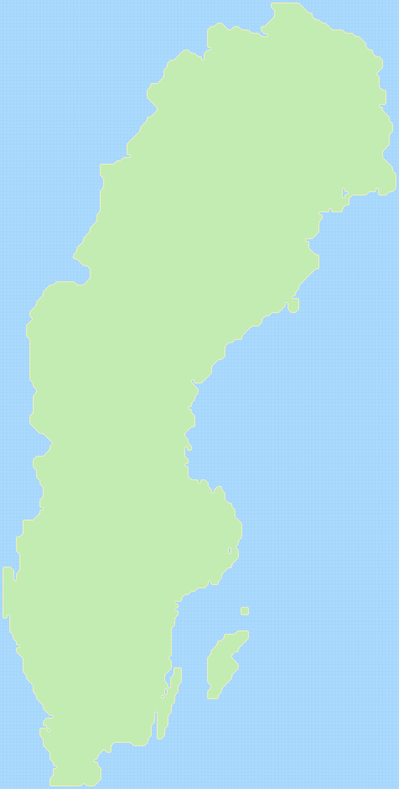

# Terrain2DRenderer
A terrain renderer for 2d grids in TypeScript, provisionally for use in canvas games or for a dynamic esthetic world map presentation.

## Notes
There are no plans set in stone, however, this is what's taken into consideration during this small project:

| Feature |
| ------- |
| In-browser performance rendering |
| Serversided tile rendering (spritesheets) for less client processing |
| Serversided static rendering |
| GeoJSON to grid processing (most likely as a module) |
| Customizable tile rendering |

## Previews
These previews are rendered inside of GitHub runners from the most latest main commit.

### Debug preview

### Island preview

### GeoJSON preview

